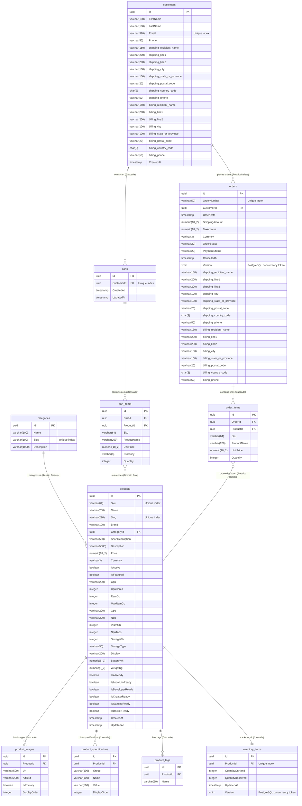

# Database Schema

The BullMarket AI Store uses PostgreSQL via Entity Framework Core with explicit table configurations.

---

## Entity-Relationship Diagram

```mermaid
erDiagram
    categories ||--o{ products : "categorizes (Restrict Delete)"
    products ||--o{ product_images : "has images (Cascade)"
    products ||--o{ product_specifications : "has specifications (Cascade)"
    products ||--o{ product_tags : "has tags (Cascade)"
    products ||--|| inventory_items : "tracks stock (Cascade)"
    
    customers ||--o{ carts : "owns cart (Cascade)"
    customers ||--o{ orders : "places orders (Restrict Delete)"
    
    carts ||--o{ cart_items : "contains items (Cascade)"
    cart_items }o--|| products : "references (Domain Rule)"
    
    orders ||--o{ order_items : "contains lines (Cascade)"
    order_items }o--|| products : "ordered product (Restrict Delete)"

    categories {
        uuid Id PK
        varchar(100) Name
        varchar(100) Slug "Unique index"
        varchar(1000) Description
    }

    products {
        uuid Id PK
        varchar(64) Sku "Unique index"
        varchar(200) Name
        varchar(220) Slug "Unique index"
        varchar(100) Brand
        uuid CategoryId FK
        varchar(500) ShortDescription
        varchar(5000) Description
        numeric(18_2) Price
        varchar(3) Currency
        boolean IsActive
        boolean IsFeatured
        varchar(200) Cpu
        integer CpuCores
        integer RamGb
        integer MaxRamGb
        varchar(200) Gpu
        varchar(200) Npu
        integer VramGb
        integer NpuTops
        integer StorageGb
        varchar(50) StorageType
        varchar(200) Display
        numeric(8_2) BatteryWh
        numeric(8_2) WeightKg
        boolean IsAiReady
        boolean IsLocalLlmReady
        boolean IsDeveloperReady
        boolean IsCreatorReady
        boolean IsGamingReady
        boolean IsDockerReady
        timestamp CreatedAt
        timestamp UpdatedAt
    }

    product_images {
        uuid Id PK
        uuid ProductId FK
        varchar(500) Url
        varchar(200) AltText
        boolean IsPrimary
        integer DisplayOrder
    }

    product_specifications {
        uuid Id PK
        uuid ProductId FK
        varchar(100) Group
        varchar(100) Name
        varchar(500) Value
        integer DisplayOrder
    }

    product_tags {
        uuid Id PK
        uuid ProductId FK
        varchar(50) Name
    }

    inventory_items {
        uuid Id PK
        uuid ProductId FK "Unique index"
        integer QuantityOnHand
        integer QuantityReserved
        timestamp UpdatedAt
        xmin Version "PostgreSQL concurrency token"
    }

    customers {
        uuid Id PK
        varchar(100) FirstName
        varchar(100) LastName
        varchar(320) Email "Unique index"
        varchar(50) Phone
        varchar(150) shipping_recipient_name
        varchar(200) shipping_line1
        varchar(200) shipping_line2
        varchar(100) shipping_city
        varchar(100) shipping_state_or_province
        varchar(20) shipping_postal_code
        char(2) shipping_country_code
        varchar(50) shipping_phone
        varchar(150) billing_recipient_name
        varchar(200) billing_line1
        varchar(200) billing_line2
        varchar(100) billing_city
        varchar(100) billing_state_or_province
        varchar(20) billing_postal_code
        char(2) billing_country_code
        varchar(50) billing_phone
        timestamp CreatedAt
    }

    carts {
        uuid Id PK
        uuid CustomerId FK "Unique index"
        timestamp CreatedAt
        timestamp UpdatedAt
    }

    cart_items {
        uuid Id PK
        uuid CartId FK
        uuid ProductId FK
        varchar(64) Sku
        varchar(200) ProductName
        numeric(18_2) UnitPrice
        varchar(3) Currency
        integer Quantity
    }

    orders {
        uuid Id PK
        varchar(50) OrderNumber "Unique index"
        uuid CustomerId FK
        timestamp OrderDate
        numeric(18_2) ShippingAmount
        numeric(18_2) TaxAmount
        varchar(3) Currency
        varchar(20) OrderStatus
        varchar(20) PaymentStatus
        timestamp CancelledAt
        xmin Version "PostgreSQL concurrency token"
        varchar(150) shipping_recipient_name
        varchar(200) shipping_line1
        varchar(200) shipping_line2
        varchar(100) shipping_city
        varchar(100) shipping_state_or_province
        varchar(20) shipping_postal_code
        char(2) shipping_country_code
        varchar(50) shipping_phone
        varchar(150) billing_recipient_name
        varchar(200) billing_line1
        varchar(200) billing_line2
        varchar(100) billing_city
        varchar(100) billing_state_or_province
        varchar(20) billing_postal_code
        char(2) billing_country_code
        varchar(50) billing_phone
    }

    order_items {
        uuid Id PK
        uuid OrderId FK
        uuid ProductId FK
        varchar(64) Sku
        varchar(200) ProductName
        numeric(18_2) UnitPrice
        integer Quantity
    }
```
